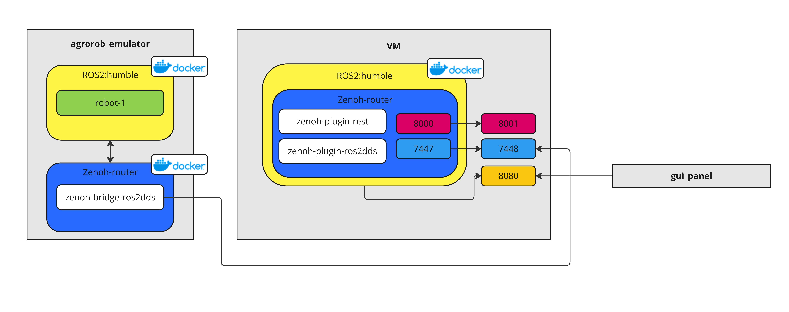

# ROS2 Env with Zenoh Router and ROS2 websocket bridge

## Ports mapping

- 7447-`8447` - Zenoh Router
- `8000` - Zenoh REST
- `8080` - ROS2 bridge websocket

## Build

```bash
# entrypoint executable
chmod +x entrypoint.sh
```

```bash
# create from docker compose
docker compose up --build
```

# Test Communication


**VM** - ROS2 Env on VM with Zenoh Router running. Zenoh router plugins: ros2dds, rest.

**agrorob_emulator** - Zenoh Bridge for ros2dds is required with router endpoint connection:
`/zenoh-bridge-ros2dds -m $ZENOH_BRIDGE_MODE  -e $ZENOH_ROUTER_TCP_ADDR`

**gui panel** - panel connected to VM with ROS2 websocket bridge.
